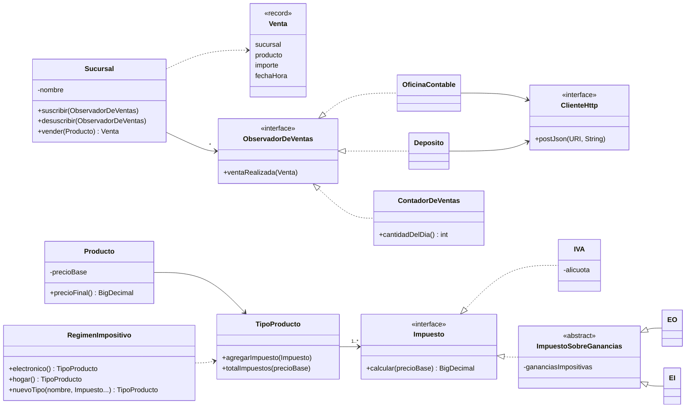

# Frávega – Sistema de sucursales

Modelado del enunciado [6-Frávega.pdf](6-Frávega.pdf) en Java 21.

```bash
mvn test                                                         # corre los tests
mvn compile exec:java -Dexec.mainClass=ar.com.fravega.Demo      # ejemplo de uso
```

## Diagrama de clases



## Decisiones de diseño

### Interesados en las ventas: Observer
`Sucursal` es el sujeto observado; cada interesado implementa `ObservadorDeVentas` y se suscribe.
Agregar un interesado nuevo no requiere tocar `Sucursal`.

- **Oficina contable** (`OficinaContable`): envía a su API REST el valor de la venta.
- **Depósito** (`Deposito`): envía a su Web API qué producto preparar para entregar.
- **Contador de ventas** (`ContadorDeVentas`): cuenta las ventas del día y reinicia la cuenta al cambiar de día.

Si un interesado falla (por ejemplo, el sistema del depósito está caído), la venta igual se concreta,
el resto de los interesados se notifica y el error queda registrado en el log.

### Sistemas externos: Adapter
`OficinaContable` y `Deposito` adaptan la interfaz `ObservadorDeVentas` al protocolo de cada sistema externo.
El transporte HTTP está detrás de `ClienteHttp` (implementado con el cliente del JDK en `ClienteHttpJdk`),
lo que permite probarlos sin depender de los sistemas reales. Las URLs de los endpoints se configuran al construirlos,
porque el enunciado no las define.

### Impuestos: composición (Strategy)
Cada impuesto implementa `Impuesto`. Un `TipoProducto` compone la lista de impuestos que le corresponde,
así que soporta tanto **tipos de producto nuevos** como **impuestos nuevos** sin modificar clases existentes.

- El **IVA es obligatorio**: el constructor de `TipoProducto` lo exige y no hay forma de quitarlo.
- **Valores que cambian**: la alícuota del IVA (21%) y las ganancias impositivas de EO ($4) y EI ($3,50)
  se actualizan en tiempo de ejecución (`actualizarAlicuota`, `actualizarGananciasImpositivas`).
- `RegimenImpositivo` crea los tipos de producto compartiendo las mismas instancias de impuestos,
  así que un cambio de alícuota se hace en un solo lugar y afecta a todos los productos.

| Impuesto | Fórmula |
|---|---|
| IVA | `0,21 × precioBase` |
| EO | `(0,5 × precioBase) / (4 × gananciasImpositivas)` |
| EI | `precioBase / 4 + 0,3 × gananciasImpositivas` |

`PrecioFinal = precioBase + Σ impuestos aplicados`, redondeado a centavos. Se usa `BigDecimal` para evitar errores
de punto flotante con dinero.

Ejemplo con precio base $1000: electrónico = 1000 + 210 + 31,25 = **$1241,25**; hogar = 1000 + 210 + 251,05 = **$1461,05**.

### Otras decisiones
- `Venta` guarda el importe calculado al momento de vender: si después cambian los impuestos, las ventas ya registradas no se alteran.
- El enunciado escribe "INA" y "El"; se interpretan como **IVA** y **EI**.
- Cada venta corresponde a un único producto ("cada vez que se vende un producto").
